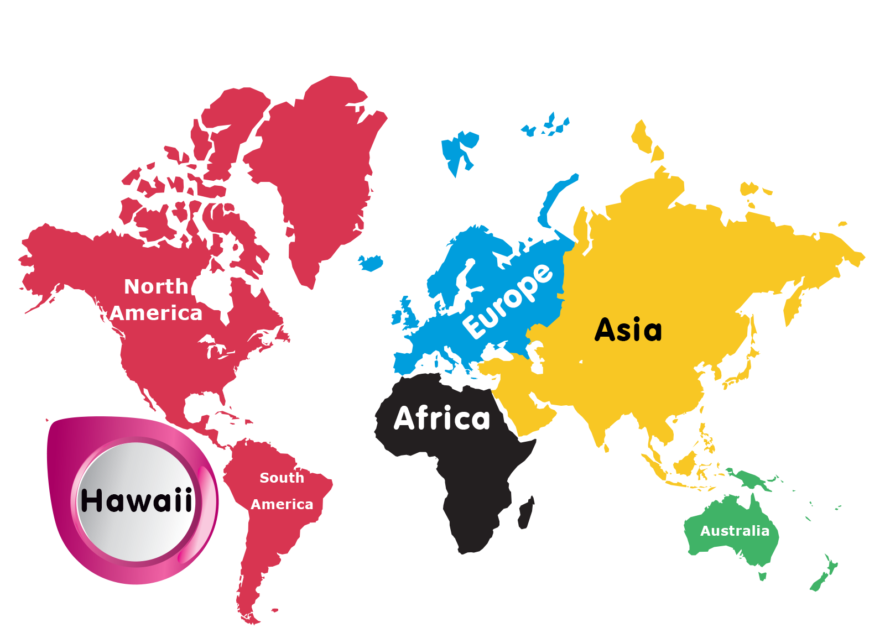

I wrote this research paper as my final for my Honors Hawaiian Studies class. Rather than deal with all the emotions behind the legitimacy of the Hawaiian annexation or the argument for Hawaiian independence, I instead decided to research what it would actually take to create a new country in today's times. This would require but is not limited to creating a new government, a capital, a flag, developing an economy and an accepted currency, forming trade and military alliances, and so on and so forth.

The paper deals with a scenario where Hawaii gains independence from the U.S., and the steps Hawaii would need to carry out in order to establish itself as a country. These include choosing a form of government and determining who counts as a Hawaiian citizen, developing a more robust economy that is not dependent on tourism or U.S. defense contracts, and most importantly — gaining recognition as a country from the United Nations and the United States.

If any of the above sounds interesting or intriguing, you can read my full paper [here](../projects/hi-aftermath.pdf).
