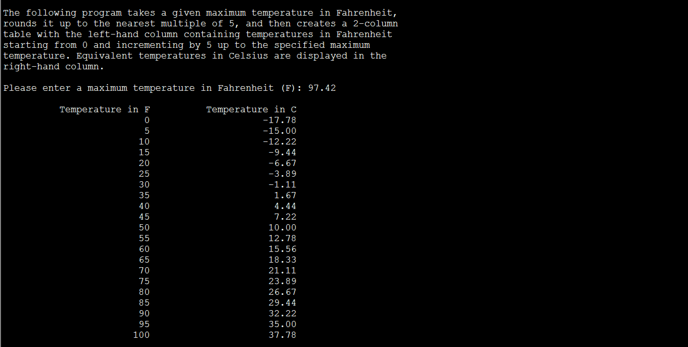

This Unix terminal program prompts the user to enter a temperature in Fahrenheit and then creates a table showing conversions between Fahrenheit and Celsuis up to the given input temperature.

The user input interface, temperature conversion and table-printing functions where all written in C++ through Unix Command Line.
 
Source code available on GitHub: <a href="https://github.com/tallasgoo/fctable"><i class="large github icon"></i>tallasgoo/fctable</a>
