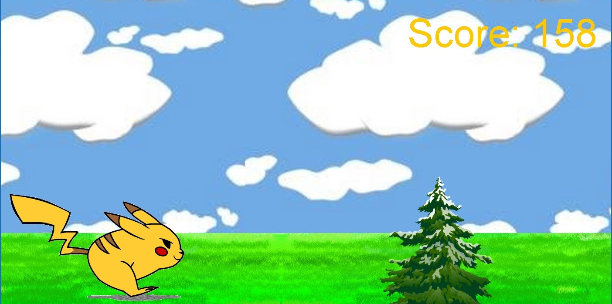

  
  
  
  

In Pikachu Sprint you control Pikachu and try to run for maximum distance while jumping over obstacles that come your way. A live score counter is displayed in the top-right corner. If the player crashes into an obstacle, the game stops and the final score is displayed along with options to play again or exit the game.

The game was written in Java using the Eclipse IDE. I created the movement and crash mechanics for the player-controlled Pikachu character and animated the character using cartoon frames from outside sources. My partner coded the randomly-generated obstacles and their hit-boxes to simulate when Pikachu would crash into or land on top of an obstacle. We both contributed to the side-scrolling animated backdrop, background music, and score counter menu.

This project was my first experience with coding gameplay physics. To make the gameplay feel somewhat more realistic, I had to simulate natural forces such as gravity and the relative speeds between the character and the oncoming objects. On a more interpersonal note, this project required me to ease back on my normally want-it-done-right-got-to-do-it-myself mentality to give my project partner the creative freedom to implement his own ideas. This was not an easy thing for me to let slide, but in the end I think the final project was all the better for it.

Check out the game's source code at GitHub: <a href="https://github.com/tallasgoo/pikachu-sprint"><i class="large github icon"></i>tallasgoo/pikachu-sprint</a>
